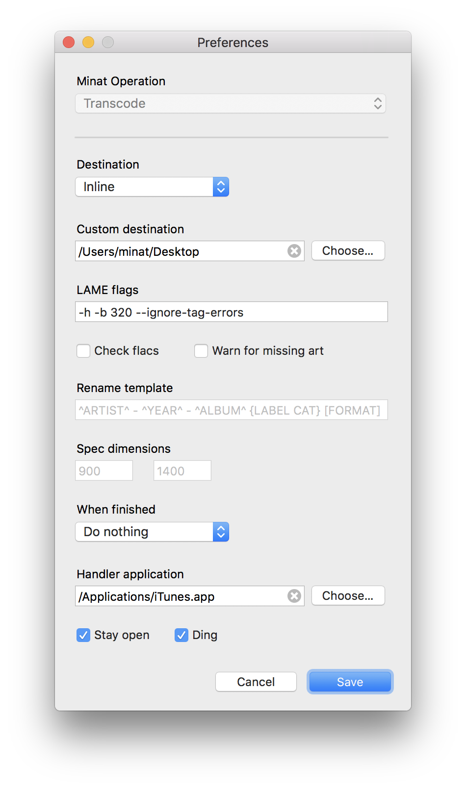

# Minat

**Minat** is a lightweight, multithreaded transcoder for Mac OS. Minat supports one operation: transcoding flac to mp3, preserving tags and album artwork. Written in PHP, Minat is lightweight and easy to modify.

Support is planned for two other operations:

* Generate specs from audio files supported by sox
* Rename folders based on the tags of the audio files inside

* **⇩ [Download Minat 0.1.4](https://github.com/)**

## Screenshot

## Notes

Running Minat requires disabling Gatekeeper by running `sudo spctl --master-disable` in the Terminal.

## Changelog

https://github.com/cylott/Minat/blob/master/CHANGELOG.md

## Building from source

Building DropToPTP requires Platypus and Pashua

* https://github.com/sveinbjornt/Platypus
* https://github.com/BlueM/Pashua